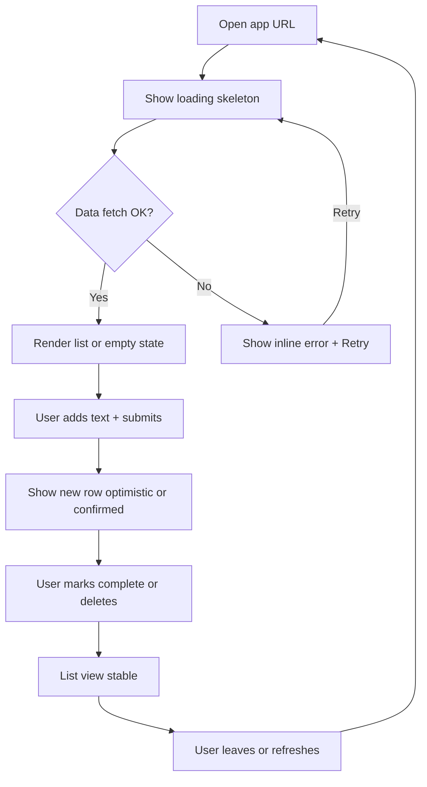
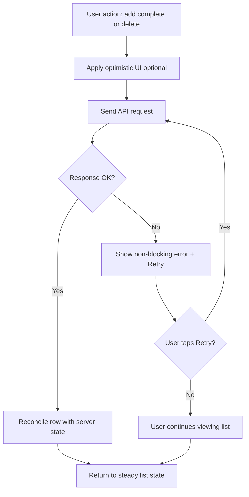

---
stepsCompleted:
  - 1
  - 2
  - 3
  - 4
  - 5
  - 6
  - 7
  - 8
  - 9
  - 10
  - 11
  - 12
  - 13
  - 14
lastStep: 14
uxWorkflowStatus: COMPLETE
completionDate: '2026-04-15'
inputDocuments:
  - _bmad-output/planning-artifacts/prd.md
  - _bmad-output/planning-artifacts/prd-validation-report.md
---

# UX Design Specification bmad-todo

**Author:** Daniella
**Date:** 2026-04-15

---

<!-- UX design content will be appended sequentially through collaborative workflow steps -->

## Executive Summary

### Project Vision

bmad-todo is a deliberately minimal **personal task** web product: a single list where users **create, view, complete, and delete** todos with **short text**, **completion state**, and **creation time**, backed by **durable persistence** and an **HTTP API**—**no accounts or collaboration** in MVP. UX success means users can run the core loop **without onboarding**, trust data **across refresh and return visits**, and always **read status and system state** (including empty, loading, and error) at a glance.

### Target Users

- **Primary persona:** an **individual** using **phone and desktop** for **personal tasks**, sometimes on **unreliable networks**.
- They value **speed to first value** (list visible immediately), **predictability** after mutations, and **low ceremony** (no sign-up, no feature tour for MVP).

### Key Design Challenges

1. **Zero-onboarding clarity** — first-time users must discover add / complete / delete without external docs (PRD success criterion 1).
2. **Resilience without anxiety** — failed saves or fetch errors must stay **non-blocking** with a credible path to **retry** or recover (Journey B, NFR-005).
3. **Responsive minimal UI** — one list model must remain **legible and tappable** on small viewports and comfortable on desktop without a separate “power UI” (NFR-002; PRD checklist TBDs).

### Design Opportunities

1. **Status-first visual language** — make **active vs completed** unmistakable; avoid relying on color alone (feeds future WCAG choice).
2. **Quiet confidence** — loading and empty states that feel **intentional**, not broken.
3. **Trace-ready UX** — align screens and states with **FR-001–FR-007** so downstream specs can reference the same names (supports closing PRD traceability gaps).

## Core User Experience

### Defining Experience

The defining experience for **bmad-todo** is a **tight CRUD loop on a single list**: the user **opens the app, sees todos, adds text items, marks them complete or deletes them**, and **trusts** that state after **refresh and return visits**. The **highest-frequency** action is **reviewing the list and toggling completion**; the **must-not-fail** action is **honest persistence** (what the user sees matches what survives on the server). If that loop feels instant and dependable, the product delivers on the PRD’s “minimal but complete” promise.

### Platform Strategy

- **Primary surface:** responsive **web** (PRD `web_app`), optimized for **common phone widths and desktop**.
- **Input modes:** **touch-first** on small screens, **mouse + keyboard** on larger screens (focus order and shortcuts can be detailed later).
- **Connectivity:** **online-first** for MVP (no offline requirement in PRD); design **graceful degradation** when offline or flaky (clear messaging, retry), not full offline task queues unless scope changes.

### Effortless Interactions

- **Instant list visibility** on load — no intermediate “landing” blocking the list (FR-002).
- **Frictionless add** — minimal fields (short description); optional enter-to-submit pattern to be detailed in interaction spec.
- **Obvious complete/delete** — single-gesture or single-click actions with **immediate local feedback**, aligned with NFR-001.
- **Automatic reconciliation** — where technically feasible, the UI **updates from mutations** without asking the user to refresh.

### Critical Success Moments

1. **First todo created** — user sees a new row appear and understands how to repeat the action (success criterion 1).
2. **Reload trust** — after refresh or later session, the list matches what they believe they saved (success criterion 2).
3. **Graceful failure** — a failed request shows **clear, non-blocking** state and a path to **retry** without losing orientation (Journey B, NFR-005).

### Experience Principles

1. **Truthful list** — prioritize clarity of **active vs completed** and honest **sync/pending/error** states over decorative UI.
2. **Quiet confidence** — **empty**, **loading**, and **error** patterns should feel **intentional and calm**, not like broken layout.
3. **Recover forward** — every error state suggests a **next safe action** (e.g. retry, dismiss, continue reading).
4. **One product, two postures** — **same tasks and mental model** on phone and desktop; density adapts, behavior does not fork.

## Desired Emotional Response

### Primary Emotional Goals

Users should feel **calm**, **in control**, and **competent** while managing a simple list—more **“quietly dependable”** than **“delightful surprise.”** The emotional payoff of bmad-todo is **trust**: the list is **there**, **readable**, and **honest** about what happened (including when the network misbehaves).

### Emotional Journey Mapping

| Stage | Desired feeling | UX direction |
|--------|-----------------|--------------|
| **First discovery** | Clear, oriented | Immediate list (or intentional empty state); obvious affordance to add a first item. |
| **Core loop** | Focused flow | Minimal chrome; fast feedback on add/complete/delete. |
| **After completing work** | Light accomplishment | Completed state reads as “done” without celebration noise. |
| **When something goes wrong** | Concern → supported | Non-blocking errors; plain language; **retry** or safe fallback; never imply total loss without cause. |
| **Returning later** | Familiar, trusted | Same layout and patterns; persistence feels expected, not magical. |

### Micro-Emotions

- **Critical to cultivate:** **confidence**, **trust**, **calm**, **mild accomplishment**.
- **Critical to avoid:** **confusion** (where do I act?), **anxiety** (is my data gone?), **frustration** (dead-end errors), **skepticism** (UI lies about saved state).

### Design Implications

- **Calm + control** → predictable **layout**, **restrained** motion and color, **no unnecessary** modals on the happy path.
- **Trust** → explicit **loading**, **empty**, **error**, and **pending sync** treatments; avoid hiding failed mutations.
- **Relief** on failure → **short** messaging, **one obvious** recovery action, preserve **context** (list remains visible when possible).

### Emotional Design Principles

1. **Emotional temperature: cool** — prioritize **readability and honesty** over stimulation.
2. **Never punish curiosity** — first actions are **reversible** or **low-cost** (delete is clear; complete is undo-friendly *if* product adds undo later—in MVP, at least avoid shaming copy).
3. **Trust through transparency** — when the system is uncertain, the **UI admits it** in human language.
4. **Accomplishment is quiet** — completion is communicated by **clear state**, not by **celebratory** patterns that clash with a minimal tool.

## UX Pattern Analysis & Inspiration

### Inspiring Products Analysis

*Illustrative comparables (replace with your preferred references if different):*

1. **Apple Reminders** — **Strengths:** calm visual noise, **readable list rows**, **obvious completion** state, familiar platform patterns. **Lesson:** let **typography and spacing** do hierarchy work before color.

2. **Google Tasks / Keep (list mode)** — **Strengths:** **fast capture**, **minimal chrome**, quick path from “open” to “something is on the list.” **Lesson:** **inline entry** beats wizard flows for MVP.

3. **Todoist (default list experience)** — **Strengths:** **checkbox / row** interaction model many users already know; actions stay **proximate** to tasks. **Lesson:** adopt **row-level** affordances; **ignore** labels/filters/projects for MVP scope.

### Transferable UX Patterns

**Navigation**

- **Single primary surface** — the **todo list** is the home experience (supports FR-002 and “no onboarding”).
- **Persistent entry affordance** — add control remains discoverable while scrolling (implementation detail follows design system).

**Interaction**

- **Inline add** — one primary text field + explicit submit and/or Enter-to-submit (supports FR-001, zero-onboarding).
- **Row-level complete and delete** — actions adjacent to the item; avoid deep menus (FR-003, FR-004).
- **Optimistic UI with recovery** — update list on intent, reconcile on server response; surface **retry** on failure (Journey B, NFR-001, NFR-005).

**Visual**

- **State-first styling** — active vs completed readable at a glance **without color-only** encoding (supports PRD clarity goal and future WCAG target).
- **Quiet system states** — empty, loading, error use **restrained** layout and copy (Desired Emotional Response).

### Anti-Patterns to Avoid

- **Modal-first task creation** or **multi-step** add flows for a single text field.
- **Gamification** and **social pressure** patterns inappropriate for a private minimal list.
- **Silent sync failure** — rows vanish or state “snaps back” without explanation.
- **Cryptic icons** for destructive actions — keep **delete** recognizable and **hard to mis-tap** on mobile.
- **Power-user density** — filters, tags, multi-project navigation (out of scope per PRD).

### Design Inspiration Strategy

- **Adopt** proven **list + inline add + row actions** patterns from mainstream task apps; they match the PRD journeys and FR set with low teaching cost.
- **Adapt** “native calm” for the **open web**—use web-accessible components, visible focus, and responsive density rather than mimicking iOS/Android pixel-for-pixel.
- **Avoid** borrowing complexity (smart scheduling, collaboration chrome, notification centers) that violates MVP boundaries.

## Design System Foundation

### 1.1 Design System Choice

**Themeable composable foundation:** **design tokens** (CSS variables or equivalent) plus **headless, accessible UI primitives** for interactive controls (list items, checkbox/toggle, text field, primary/secondary buttons, inline alerts).

*Implementation pairing (to align with technical architecture):* **Tailwind CSS + Radix UI** (or **shadcn/ui** on React) is the **default recommendation** for this PRD class; if the project standardizes on another web framework, adopt the same **pattern**—utility or token layer + **accessible primitive layer**—rather than a fully bespoke component set for MVP.

### Rationale for Selection

1. **MVP speed** — list, add, complete, delete maps cleanly to **small set of composed primitives** without building a design system from scratch.
2. **Accessibility path** — headless libraries expose **roles, focus, and keyboard** behavior needed when PRD checklist sets a **WCAG** target.
3. **Emotional + pattern fit** — **token-driven** neutrals, spacing, and type support **calm**, **quiet confidence** (Desired Emotional Response) and **state-first** visuals (Inspiration).
4. **Flexibility** — “calm minimal” is achieved by **theme**, not by avoiding libraries; avoids lock-in to one **heavy** branded look (e.g. full Material chrome) while still allowing Material-*inspired* motion if desired.

### Implementation Approach

- **Tokens first** — define **color** (background, surface, border, text primary/secondary, success/warning/error muted), **typography** scale, **spacing** rhythm, **radius**, **elevation**, **focus ring**, and **motion** (with **prefers-reduced-motion** fallback).
- **Compose screens** from: **list container**, **row** (title + meta + actions), **inline add** (text + submit), **empty / loading / error** banners or inline regions.
- **Wire to FRs** — component names in implementation specs should trace to **FR-001–FR-007** and NFR states (pending, error, success).
- **Framework** — final package names live in **architecture**; UX spec assumes **one** primitive stack per web app, not mixing competing systems.

### Customization Strategy

- **Brand:** restrained **neutral-first** palette; **one** accent for primary actions only; avoid loud gradients for MVP.
- **Density** — **comfortable** touch targets on mobile; **slightly denser** row height on desktop while keeping **same** actions.
- **Completion treatment** — choose **one** clear pattern (e.g. strike + muted text **and** non-color cue) and apply consistently.
- **Evolution** — add **dark mode** or richer theming later via tokens without redesigning interaction model.

## 2. Core User Experience

### 2.1 Defining Experience

The defining experience for **bmad-todo** is **“trusted list state”**: users **see their todos immediately**, **add in one beat**, **mark complete or delete with confidence**, and **reload without doubt** that persistence matches what they remember. If that sentence feels true in real use, the product has delivered its PRD promise; everything else is secondary polish.

### 2.2 User Mental Model

Users bring a **simple list** mental model—**sticky note**, **Notes app**, or **checkbox paper list**: one surface, ordered items, **done = visually finished**, **delete = removed**. They expect **zero account setup** and **no hidden modes**. Confusion spikes when **done state lies**, **items disappear** without intent, or **errors block** seeing the list they were just managing.

### 2.3 Success Criteria

- **Immediate orientation** — within one screen, users can answer: *What do I have to do?* and *How do I add one?* (supports PRD success #1).
- **Honest feedback** — every mutation shows **pending / success / failure** in a way that does not **break trust** in the list (NFR-001, NFR-005, Journey B).
- **Reload fidelity** — after refresh or return visit, **visible list matches** persisted todos for that environment (PRD success #2, FR-006).
- **Clarity of state** — active vs completed and system states (empty, loading, error) are **readable without a legend** (PRD success #3).

### 2.4 Novel UX Patterns

**Established patterns dominate**—single-column **list**, **inline add**, **row-level complete/delete**, optional **optimistic UI** with **retry**. **No new interaction metaphor** is required for MVP; innovation is **execution quality** (calm, accessible, resilient) within familiar patterns.

### 2.5 Experience Mechanics

**1. Initiation**

- User opens the **app URL** (or pinned tab). System shows **list skeleton or list** immediately; **empty state** invites first add without tutorial copy.

**2. Interaction**

- **Add:** user focuses **primary text field**, types short description, submits via **button** and/or **Enter** (FR-001). New row **appears in list** with creation metadata when shown (FR-005).
- **Complete:** user activates **checkbox or row control** (FR-003); row moves to **completed presentation** per design tokens.
- **Delete:** user triggers **destructive control** with **clear affordance** and **safe hit target** (FR-004); row removes or shows undo policy per product decision (MVP: confirm only if needed for risk).

**3. Feedback**

- **Optimistic:** row updates on intent; **reconcile** on server response; on conflict, **surface** inline message and **prefer truth** from server without silent loss (NFR-003, NFR-005).
- **Network failure:** **non-blocking** banner or row-level state + **Retry**; list remains **visible** when possible.

**4. Completion**

- Successful add/complete/delete ends with **stable list view**—no forced navigation away. User continues in **flow** until they leave the tab; **returning later** repeats initiation with **same trust**.

## Visual Design Foundation

### Color System

**Inputs:** No standalone brand guidelines were provided with the PRD; palette is **UX-derived** and should be implemented as **design tokens** (aligned with Design System Foundation).

**Strategy**

- **Neutral-first:** cool **gray** canvas and surfaces; **high-contrast** text on background (target **WCAG AA** contrast once WCAG level is chosen in PRD).
- **Single accent:** one **primary** hue reserved for **primary button**, **key focus ring**, and **critical links**—avoid rainbow accents for MVP.
- **Semantic (muted):** **success** (sync ok / saved), **warning** (degraded / retry suggested), **error** (failed save / fetch)—saturation **restrained** to preserve calm emotional goals.
- **Completion:** reduce emphasis via **typography + opacity** (and optional **strikethrough**); **do not** rely on green/red alone for done vs active.

**Dark mode (optional later)**  
Define parallel token set when needed; keep **same** interaction hierarchy.

### Typography System

**Tone:** **modern, calm, utilitarian**—readable list UI, not marketing headline energy.

**Type stack**

- **Primary:** `system-ui`, `-apple-system`, `Segoe UI`, `Roboto`, `Helvetica Neue`, `Arial`, sans-serif.
- **Optional web font:** **Inter** (or equivalent) if cross-platform consistency matters more than zero font load.

**Scale (starting point for implementation)**

| Role | Approx. | Use |
|------|-----------|-----|
| **App title** | 20–24px / 1.25–1.5rem | Header / product name if shown |
| **Body** | **16px** / 1rem | Row title, add field input |
| **Meta** | 14px / 0.875rem | Timestamps, helper text |
| **Label / button** | 14–16px, medium weight | Primary actions |

**Rules**

- **Body minimum 16px** for primary reading and inputs on mobile.
- **Line height** ~1.5 for body/meta blocks; slightly tighter for single-line rows if needed for density on desktop only.

### Spacing & Layout Foundation

- **Base unit:** **8px** grid; **4px** for fine alignment (icon to text, inline chips).
- **Layout:** **single-column** primary content; optional **max width** on large monitors so list and add field do not stretch unreadably wide (recommend **~40–45rem** content column unless full-bleed is intentional).
- **Density:** **comfortable** on mobile (row height supports **≥44px** vertical tap targets including spacing); desktop may **tighten slightly** without shrinking touch targets on hybrid devices.
- **Elevation:** minimal—**subtle border** or **soft shadow** only where separation from canvas is needed (e.g. optional card container).

### Accessibility Considerations

- **WCAG level:** PRD lists **TBD**—UX spec assumes **WCAG 2.1 Level AA** as the **default design target** until product explicitly chooses A or AA.
- **Contrast:** validate **text**, **icons**, **controls**, and **focus ring** against chosen level.
- **Focus:** always **visible** keyboard focus on interactive elements; do not remove outlines without replacement.
- **State:** completed/active/error communicated with **text, structure, or icon** in addition to any color.
- **Motion:** honor **`prefers-reduced-motion`**; keep transitions **short** and **non-blocking** for list updates.

## Design Direction Decision

### Design Directions Explored

Six static directions are captured in **`ux-design-directions.html`** in `_bmad-output/planning-artifacts/`:

| # | Label | Summary |
|---|--------|---------|
| 1 | Calm canvas list | Neutral cool canvas, subtle borders, single blue primary — aligns with Visual Design Foundation and “quiet confidence.” |
| 2 | Card-contained rows | Todo rows as elevated cards on gray field — stronger separation, slightly warmer object feel. |
| 3 | Dense productivity | Tighter vertical rhythm — more density; requires device validation for touch targets. |
| 4 | Soft & spacious | Larger padding and type — calmer, fewer items per viewport height on mobile. |
| 5 | Accent-forward header | Bold top bar + white list — more branded “app” energy; monitor completed-row contrast. |
| 6 | Mono editorial | Serif + high-contrast rules — notebook personality; validate accessibility if selected. |

### Chosen Direction

**Direction 1 — Calm canvas list** *(documented as stakeholder default after step 9; override in a PR revision if the HTML review selects another direction).*

### Design Rationale

- **Emotional fit:** supports **calm**, **trust**, and **low ceremony** from Desired Emotional Response.
- **PRD fit:** keeps **list-first** hierarchy and **state clarity** without extra chrome.
- **Execution fit:** maps cleanly to **token + primitive** approach (Design System Foundation) and **WCAG 2.1 AA** as the working contrast target.
- **Risk reduction:** avoids experimental density or high-contrast novelty for MVP unless product explicitly wants that personality.

### Implementation Approach

- Implement **Direction 1** as the **baseline theme** in code (CSS variables / Tailwind theme).
- Port **specific parameters** (exact neutrals, accent hue, row radius) from Visual Design Foundation into the component library.
- If a **hybrid** is chosen later (e.g. Direction 1 list + Direction 4 spacing), capture deltas as **token overrides** only—do not fork layout logic.

## User Journey Flows

### Journey A — Daily check-in

**Goal:** User manages personal todos in one session with **zero tutorial**, sees **immediate list state**, and trusts **persistence** when they return.

**Flow summary**

1. **Entry:** user opens the app URL (deep link or bookmark).
2. **Orientation:** system shows **loading skeleton** then **list** or **empty state** with clear “add first todo” affordance.
3. **Add:** user focuses add field, types short text, submits (**button** or **Enter**). Row appears (**optimistic** or confirmed per implementation).
4. **Complete:** user toggles completion control; row moves to **completed** presentation.
5. **Delete:** user triggers delete; row is removed per product rule (immediate delete vs confirm — document in architecture if confirm is required).
6. **Exit:** user closes tab or navigates away.
7. **Return:** user reopens; **same list state** loads (FR-006, success criterion 2).

### Journey B — Interrupted session

**Goal:** When the network or API fails during a mutation, the user stays **oriented**, sees **non-blocking** feedback, and can **retry** without losing the list context.

**Flow summary**

1. User performs **add**, **complete**, or **delete**.
2. UI applies **optimistic** update where used.
3. Server responds **error** or **timeout**.
4. UI shows **banner or row-level** error with **Retry**; list remains **visible** when possible.
5. User taps **Retry**; client re-issues operation or refetches.
6. On success, UI **reconciles** with server truth; on repeated failure, message escalates slightly but remains **recoverable** (no dead end).

### Journey Patterns

- **Single-home navigation** — no secondary app chrome; all flows live on **one list screen**.
- **Inline commitment** — add and primary edits happen **in place**, not in modals.
- **Honest progress** — **loading** for initial fetch; **pending** optional per-row for mutations; **error + retry** shared pattern.
- **Server wins on conflict** — after failed optimistic path, **surface** discrepancy and refresh row from server when available.

### Flow Optimization Principles

1. **Minimize steps to first value** — first meaningful screen is **list or empty**, not marketing or setup.
2. **Reduce cognitive load** — one primary field for add; **one** obvious recovery action on errors.
3. **Preserve context on failure** — do not replace entire screen with error page; keep **list frame** when possible.
4. **Quiet accomplishment** — success is **visible list state**, not celebratory interruptions.

## Component Strategy

### Design System Components

From the **themeable headless** approach (Tailwind-style tokens + Radix-class primitives), use stock building blocks wherever possible:

| Primitive | Use in bmad-todo |
|-----------|------------------|
| **Button** | Primary **Add**, secondary actions, **Retry** |
| **Text input** | Add-todo field (single line; `enterkeyhint` / submit behavior in implementation) |
| **Checkbox or switch primitive** | Mark complete / incomplete (visually paired with row styling) |
| **Label / visually hidden label** | Associate control with row text for screen readers |
| **Separator / border utilities** | Row dividers per Direction 1 |
| **Focus trap utilities** | Only if a dialog is introduced (e.g. destructive confirm) |

### Custom Components

These are **composed** layers—own the UX contract and FR mapping; implement with design tokens + primitives above.

#### `AppShell`

- **Purpose:** Page frame (optional title, max-width container, background).
- **States:** default only for MVP.
- **Accessibility:** `main` landmark; skip link optional later.

#### `AddTodoBar`

- **Purpose:** FR-001 — create todo; always visible or sticky below header.
- **States:** default, **disabled** while submitting, **error** inline under field on validation failure.
- **Accessibility:** `aria-describedby` to error text; submit on **Button** and optionally **Enter**.

#### `TodoList`

- **Purpose:** FR-002 — scrollable list container; handles ordering (product rule: e.g. newest top—confirm in architecture).
- **States:** **loading** (skeleton children), **empty** (child `EmptyState`), **populated**, **partial error** (banner sibling).

#### `TodoRow`

- **Purpose:** FR-003, FR-004, FR-005 — one todo: description, meta (created time), complete toggle, delete.
- **States:** active, **completed** (visual + `aria-checked`), **pending sync** (optional subtle indicator), **row error** (inline retry for that row if product chooses per-row vs global banner).
- **Accessibility:** row as **group** or listitem with `checkbox` labelled by task text; delete exposes **accessible name** “Delete {task}”.

#### `LoadingSkeleton`

- **Purpose:** Initial fetch and optional refresh.
- **States:** shimmer or static blocks; honor `prefers-reduced-motion`.

#### `EmptyState`

- **Purpose:** First-run zero todos; short headline + hint to use add field.
- **Content:** no marketing essay; one sentence max.

#### `ErrorBanner` (global)

- **Purpose:** Journey B — non-blocking API/network errors with **Retry** and optional dismiss.
- **Role:** `role="alert"` or `status` depending on interruptiveness; keyboard access to **Retry**.

#### `DeleteConfirmDialog` (optional)

- **Purpose:** If product requires confirm for delete; otherwise omit for MVP speed.
- **States:** open/closed; focus trap; destructive button styling.

### Component Implementation Strategy

1. **Token-only styling** for colors, radius, spacing—**no** hard-coded hex in leaf components except token fallbacks during migration.
2. **One row component** handles both mobile and desktop density via **responsive props** or CSS breakpoints.
3. **Map components to FR IDs** in dev specs (`TodoRow` ↔ FR-003/004/005, etc.) for traceability.
4. **Test states** in Storybook (or equivalent): empty, loading, single row, many rows, error banner, row error.

### Implementation Roadmap

**Phase 1 — MVP-critical**

- `AppShell`, `AddTodoBar`, `TodoList`, `TodoRow`, `LoadingSkeleton`, `EmptyState`, `ErrorBanner`

**Phase 2 — Hardening**

- Optional `DeleteConfirmDialog`, per-row **pending** indicators, improved **retry backoff** messaging (copy only; logic in architecture)

**Phase 3 — Enhancement (post-MVP)**

- Dark mode token set, optional **undo** snackbar if product adds undo, keyboard shortcuts doc

## UX Consistency Patterns

### Button Hierarchy

| Level | When to use | Visual |
|-------|-------------|--------|
| **Primary** | Single default action per context: **Add** todo, **Retry** when it is the only recovery action | Filled accent (Direction 1 token); full-width on narrow mobile optional |
| **Secondary** | **Dismiss** error, **Cancel** in dialogs (if any) | Ghost or outline; never competes visually with primary |
| **Destructive** | **Delete** in confirm dialog only; inline delete is **tertiary** (text or icon) with strong a11y name—not the same visual weight as primary | Muted until hover/focus unless in confirm |

**Rules**

- At most **one** primary button in the add bar at a time.
- **Icon-only** delete must have **tooltip + `aria-label`** on desktop; on touch, prefer **larger hit area** over tiny icon alone.

### Feedback Patterns

| Type | When | UX |
|------|------|-----|
| **Loading (initial)** | First paint / fetch | `LoadingSkeleton` inside list area; do not block add bar unless product chooses lock-while-loading |
| **Empty** | Zero todos | `EmptyState` — one short line + pointer to add field |
| **Success (mutation)** | Save OK | Prefer **inline truth** (row appears/updates); optional **subtle** toast only if team standard requires—default **no toast** for calm |
| **Warning** | Degraded but usable | Muted banner; copy explains limitation; **optional** action |
| **Error (recoverable)** | API/network failure | `ErrorBanner` or row scope; always offer **Retry**; never imply total data loss without verification |
| **Error (validation)** | Empty text submit | Inline under field; **preserve** typed text when reasonable |

**Motion:** respect `prefers-reduced-motion`; limit height/opacity transitions on rows.

### Form Patterns

- **Single field MVP** — add field is **one required** text control; trim whitespace; max length aligned with PRD “short” description (exact cap in architecture/API).
- **Submit paths** — **Button** + **Enter** (with `enterkeyhint="done"` or `send` on mobile as appropriate).
- **Disable during flight** — disable **Add** or show pending state to prevent double-submit; re-enable on success or recoverable error.
- **Errors** — attach message with `aria-describedby`; move focus to field only when blocking (usually not for empty submit if field already focused).

### Navigation Patterns

- **Single view** — no tabs, drawers, or settings in MVP. URL is **entry**; optional future deep links documented in architecture only.
- **Scroll** — list scrolls inside viewport; **add bar** sticky or top-fixed per implementation choice—**consistent** everywhere.
- **Focus order** — logical: add field → primary button → first row controls → subsequent rows (document skip patterns if list is long).

### Additional Patterns

- **Delete** — default **immediate delete** with **undo optional post-MVP**; if confirm dialog is used, use **destructive** button styling and restore focus to triggering row on cancel.
- **Completed tasks** — one system: **strike + muted + checkbox state**; do not mix “hide completed” in MVP unless PRD changes.
- **Keyboard** — Space toggles focused checkbox; **Enter** from row does not accidentally delete (delete not default action).
- **Internationalization** — copy centralized for empty/error strings even if v1 is English-only.

## Responsive Design & Accessibility

### Responsive Strategy

- **Mobile-first** — layout, tap targets, and copy priority are designed for **narrow viewports** first; desktop adds **horizontal breathing room** and optional **slightly denser** row height only where touch is not primary.
- **Desktop** — use extra width for **readable line length** (max-width on content column ~40–45rem) and optional **wider add field**; **do not** introduce a second content column or navigation rail for MVP.
- **Tablet** — treat as **large touch**: same patterns as mobile; validate **landscape** with comfortable row height and non-overlapping controls.

### Breakpoint Strategy

| Range | Label | Layout notes |
|-------|--------|----------------|
| **0–639px** | Phone | Full-bleed list; add bar full width; minimum **44×44px** touch targets |
| **640–1023px** | Large phone / tablet | Optional centered column; maintain touch targets |
| **1024px+** | Desktop | Centered column or generous margins; keyboard focus rings always visible |

Breakpoints are **starting points**; refine with real device QA. Use **relative units** (`rem`, `%`, `min-height`) for typography and spacing.

### Accessibility Strategy

- **Target:** **WCAG 2.1 Level AA** for text, UI components, and focus visibility (confirm in PRD web checklist when product signs off).
- **Contrast:** normal text **≥ 4.5:1** against background; large text **≥ 3:1**; **non-text** controls and focus indicators meet **3:1** where applicable.
- **Keyboard:** full **visible focus order** through add bar and all row actions; **no keyboard traps** except intentional modal dialogs.
- **Screen readers:** semantic **list** for todos; checkbox **labelled** by task text; **live region** or `role="status"` for non-interrupting sync messages if used.
- **State:** **never color-only** for active vs completed; support **200% zoom** without broken layout.
- **Motion:** honor **`prefers-reduced-motion`** for list transitions and skeleton shimmer.

### Testing Strategy

**Responsive**

- Physical devices: **small iOS + Android**, one **desktop** browser width.
- Browsers: **Chrome, Safari, Firefox, Edge** (latest two majors where feasible).
- Check **320px** width for overflow and **landscape** phone for vertical space.

**Accessibility**

- **Automated:** axe or equivalent in CI on main views (empty, populated, error).
- **Manual:** full **keyboard-only** pass; **VoiceOver** (iOS/macOS) and **NVDA** or **JAWS** (Windows) spot-check on list + add + error + retry.
- **Zoom** to 200%; quick **color blindness** simulation on completed vs active styling.

### Implementation Guidelines

**Responsive**

- Mobile-first **min-width** media queries; avoid fixed `px` widths for layout shells.
- Test **sticky add bar** with on-screen keyboard if applicable (PWA/browser behavior).
- Images: none required for MVP list; any future icons as **SVG** with accessible names.

**Accessibility**

- Use **semantic** elements (`button`, `input`, `ul`/`li` or `role="list"` pattern per framework).
- **`aria-live`** sparingly for batch updates; prefer **visible** list changes over noisy announcements.
- **Dialogs:** trap focus, **return focus** to trigger on close, `aria-modal="true"`.
- Document **skip link** as optional enhancement if list grows very long.
